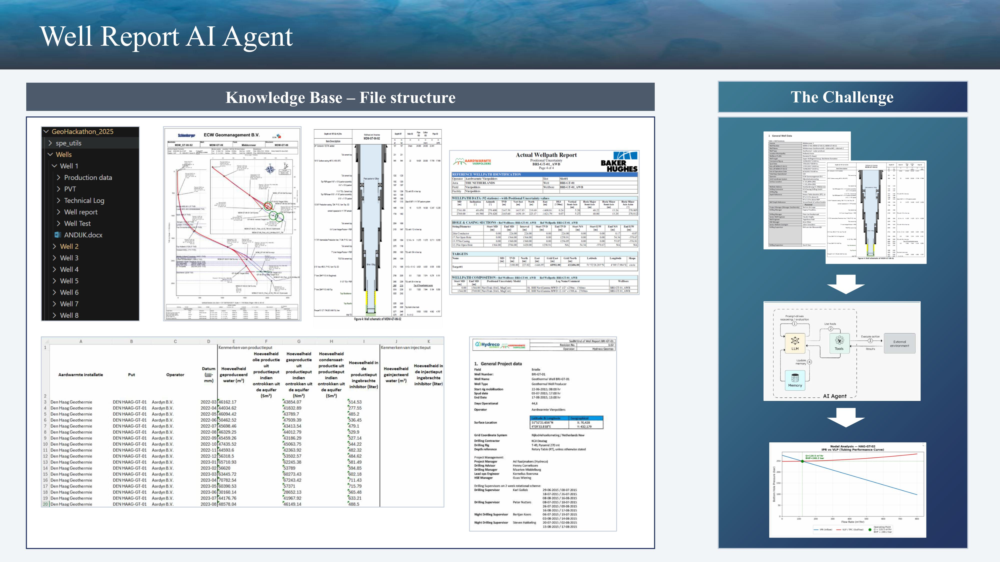
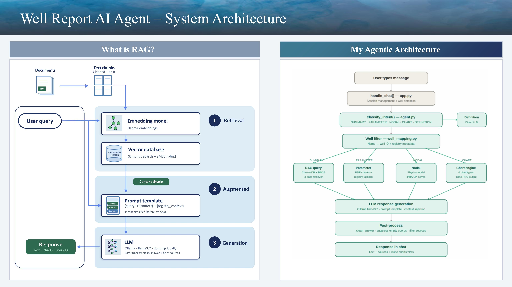
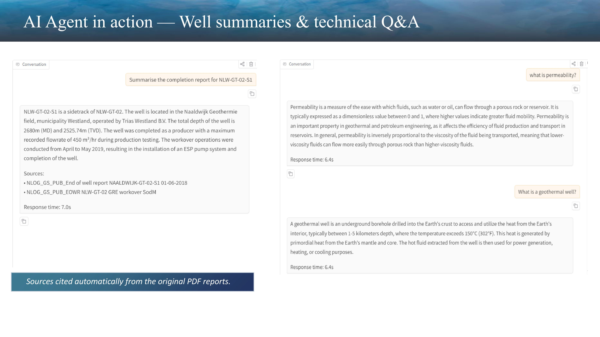
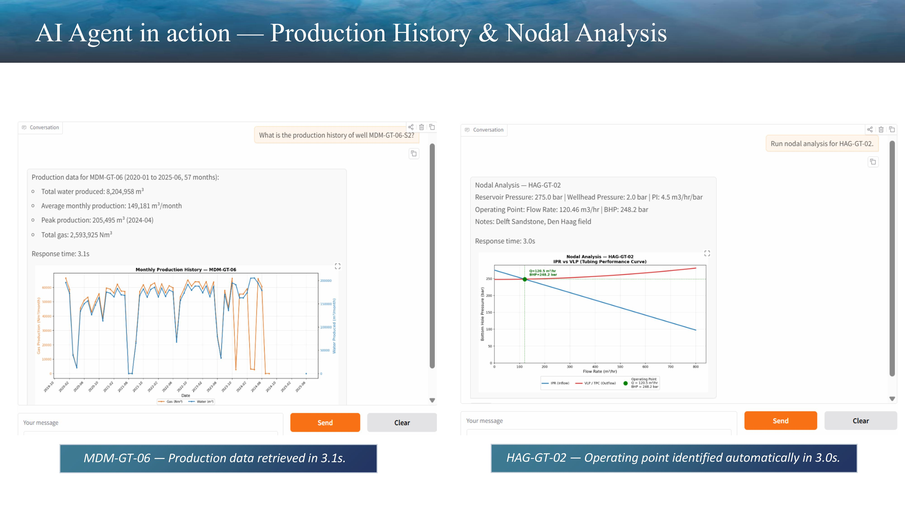
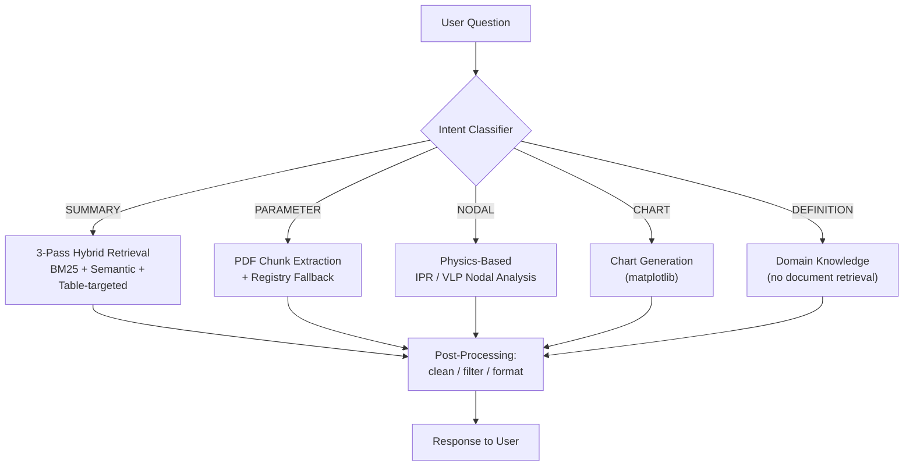

# SPE GeoHackathon 2025 — Well Report AI Agent


## 🚀 Live Demo

Try the app directly — no installation required:

**[▶ Open Well Report AI Agent on Hugging Face Spaces](https://huggingface.co/spaces/jcamposv16/well-report-agent)**

A RAG-powered agentic AI system that answers engineering questions from 13 geothermal well completion reports, running fully offline. Built for the **SPE GeoHackathon 2025** challenge.

No cloud. No API costs. Full data privacy — every model, every document, and every byte of inference stays on your machine.

---

## What the System Does

The agent ingests **95 PDFs** (completion reports, end-of-well reports, positional surveys) and one Excel file (`boreholes.xlsx`) with production data, then routes every user question through an intent classifier before deciding how to answer it.

Each question is classified into one of five intent types:

| Intent | Behavior |
|---|---|
| **SUMMARY** | Triggers a 3-pass hybrid retrieval — BM25 keyword search anchored on well ID, semantic search via ChromaDB, and a table-targeted pass for structured data |
| **PARAMETER** | Extracts specific values from PDF chunks, with a registry fallback when RAG retrieval fails |
| **NODAL** | Runs physics-based IPR/VLP nodal analysis using well-specific reservoir pressure, productivity index, and TVD — the operating point is calculated from physics, not from the LLM |
| **CHART** | Generates one of four chart types inline in the chat: production history, cumulative production, gas trend, monthly comparison by year |
| **DEFINITION** | Bypasses documents entirely and answers from domain knowledge |

Every response is post-processed regardless of intent: answers are cleaned, irrelevant sources are filtered out, and empty coordinate blocks are suppressed.

## Screenshots

### Knowledge Base & The Challenge


### System Architecture


### AI Agent in Action — Well Summaries & Q&A


### AI Agent in Action — Production & Nodal Analysis


## Architecture



### Key Architecture Decisions

- **Registry fallback** — well metadata is injected into the system prompt separately from the user query, rather than concatenated into it, to avoid confusing the embedding model with mixed signal.
- **Query cleaning** — the registry prefix is stripped from the query before it reaches the retriever, so retrieval only ever sees the engineer's actual question.
- **3-pass retrieval** — a single semantic pass isn't enough when wells share the same reservoir formation and region: their reports are textually similar enough to confuse the embedding model. Anchoring one pass on the well ID (BM25) and running a dedicated table-targeted pass alongside the semantic pass solves this.

## Tech Stack

| Layer | Technology |
|---|---|
| LLM | [llama3.2](https://ollama.com/library/llama3.2) via [Ollama](https://ollama.com/) (runs locally, CPU only) |
| Orchestration | [LangChain](https://www.langchain.com/) |
| Vector store | [ChromaDB](https://www.trychroma.com/) |
| Keyword search | [BM25](https://github.com/dorianbrown/rank_bm25) (`rank_bm25`) |
| Embeddings | HuggingFace `sentence-transformers/all-MiniLM-L6-v2` |
| PDF parsing | `pdfplumber` + `PyMuPDF` |
| UI | [Gradio](https://www.gradio.app/) |
| Charts | `matplotlib` |
| Data | `pandas`, `duckdb` |

## Project Structure

```
src/
  app.py                   — Gradio UI and main entry point
  agent.py                 — Intent classification and agent orchestration
  ingest.py                — PDF ingestion, chunking, vectorstore creation
  rag_pipeline.py           — 3-pass WellFilterRetriever
  well_mapping.py           — Well name to ID mapping and registry metadata
  well_data.py              — Production data loader from Excel
  nodal_analysis.py         — IPR/VLP physics model
  production_analysis.py    — Chart generation
  tubular_extractor.py      — PDF table extraction with pdfplumber
  llm_loader.py             — Ollama LLM loader

GeoHackathon_2025/
  Wells/                    — Well completion PDFs (13 wells, 95 documents)
  boreholes.xlsx            — Production and well data
  spe_utils/                — SPE challenge utilities
```

## Prerequisites

- [Ollama](https://ollama.com/download) installed and running locally
- The `llama3.2` model pulled: `ollama pull llama3.2`
- Python 3.11+
- All packages from `requirements.txt`

## Setup and Installation

1. Clone the repo:
   ```bash
   git clone https://github.com/jcamposv16/GeoHackathon_2025.git
   cd GeoHackathon_2025
   ```
2. Install dependencies:
   ```bash
   pip install -r requirements.txt
   ```
3. Copy `.env.example` to `.env` and configure:
   - `VECTOR_DB_DIR` — path where the vector database will be stored
   - `PDF_CACHE_DIR` — path where converted PDFs will be cached
   - Other variables (`LLM_NAME`, `MODEL_EMBED`, `CHUNK_SIZE`, etc.) already ship with sensible defaults in `.env.example`
4. Run the app:
   ```bash
   python -m src.app
   ```
5. Open your browser at [http://localhost:7860](http://localhost:7860)

## Important Notes

- The **first run** builds the vectorstore and BM25 index from the PDFs — this takes several minutes.
- **Subsequent runs** reload from cache and start in seconds.
- Well report PDFs are included in the repo under `GeoHackathon_2025/Wells/` since they are public [NLOG](https://www.nlog.nl/) documents.
- The vector database and PDF cache are stored **outside the repo** (configured via `.env`) and are not tracked by git.

## Example Queries

- *"Summarise the completion report for NLW-GT-02-S1"*
- *"What is the measured depth of ADK-GT-01?"*
- *"Run nodal analysis for HAG-GT-02"*
- *"Show production history for MDM-GT-06"*
- *"What is permeability?"*

## Connect

Built by Jean Carlos Campos Valverde for the SPE GeoHackathon 2025.

[](https://www.linkedin.com/in/jc-campos-valverde/)
